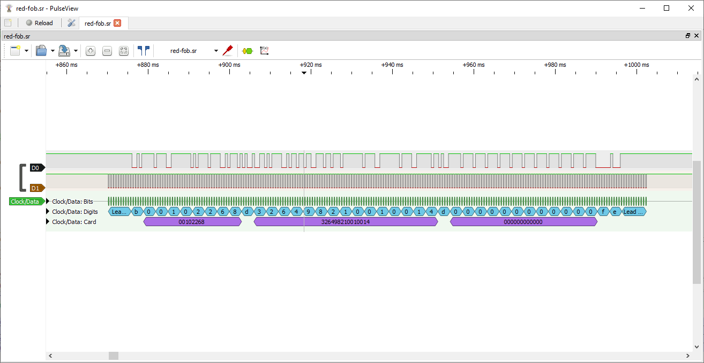

# Paxton RFID clock and data decoder for Sigrok

Sigrok protocol decoder for clock and data output from Paxton RFID readers.
Paxton RFID readers output the fob/card serial number as a clock and data output.
characters are encoded as 4 bits little endian number + 1 bit odd parity
e.g. 3 = 1100(1)

The output is of the format:  
10 bits leadin  
start character "B"  
card number  
stop character "F"  
LRC  
10 bits leadout  

If a switch2 fob or card is scanned additional data is generated with the character "d" as a separator between these fields.
This has not been fully decoded yet and investigating this is why I wrote this decoder.

The decoder supports a configurable number of lead-in and lead-out bits (default 10), data polarity and valid clock edge.
The default values are correct for Paxton readers but it should be useable with other clock and data output formats.

Screenshot from PulseView:

# Installation

Copy the paxton folder and its contents to  
`~/.local/share/libsigrokdecode/decoders` (Linux) or  
`C:\Program Files\sigrok\PulseView\share\libsigrokdecode\decoders` (Windows).  
